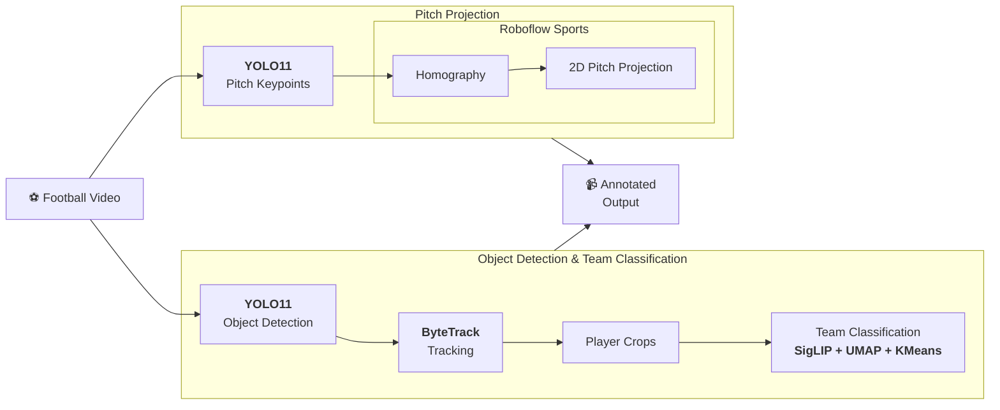

# ⚽ Football Tracking Homography

This project analyzes football match videos using computer vision. The system detects and tracks players, goalkeepers, referees, and the ball, classifies players by team, detects pitch landmarks, and projects player positions onto a 2D model of the football pitch using homography.

The main pipeline produces an annotated output video. A separate review mode generates synchronized videos for inspecting the source footage, detections, pitch keypoints, pitch projection, and combined results.

An interactive review mode is also available for inspecting the different stages of the pipeline.

## 🔀 Pipeline



## 🛠️ Technologies

- **YOLO11** - Object and pitch landmark detection
- **ByteTrack** - Multi-object tracking across video frames.
- **SigLIP, UMAP, and KMeans** are used to group players into teams based on their appearance.
  - **SigLIP** - Player appearance embeddings
  - **UMAP** - Embedding dimensionality reduction
  - **KMeans** - Team clustering
- **Roboflow Sports** - Football pitch definitions and view transformation utilities.

## 🚀 Setup

Requires Python 3.10+.

Create and activate a virtual environment from the repository root:

```bash
python -m venv .venv
```

Windows PowerShell:

```powershell
.venv\Scripts\Activate.ps1
```

macOS / Linux:

```bash
source .venv/bin/activate
```

Install the project from the repository root:

```bash
pip install -e .
```

For visualization and debugging scripts:

```bash
pip install -e ".[debug]"
```

To download YouTube clips, install `ffmpeg` and Deno for `yt-dlp`. On Windows, install `ffmpeg` with `winget install ffmpeg`. Install Deno with `irm https://deno.land/install.ps1 | iex`.

## 🤖 Models

The project uses custom-trained **YOLO11** weights. The required model weights should be placed in `models/`:

| File                                      | Purpose                                   | Used by                                                |
| ----------------------------------------- | ----------------------------------------- | ------------------------------------------------------ |
| `models/football_players_yolo11s_best.pt` | Detects ball, goalkeeper, player, referee | `football_tracking.config.WEIGHTS_PATH`                |
| `models/pitch_landmarks_yolo11n_best.pt`  | Detects pitch landmarks for homography    | `football_tracking.config.PITCH_KEYPOINT_WEIGHTS_PATH` |
| `models/pitch_keypoints_yolo11s_best.pt`  | Alternative pitch keypoint model          | Not currently used                                     |

## ▶️ Usage

Launch the desktop UI to choose a local video or YouTube URL, processing options, and output mode:

```bash
python main.py
```

Process a local video and save a single annotated video (default: `outputs/tracked_output.mp4`):

```bash
python main.py --video-path downloads/clip.mp4
```

Process a local video and open the synchronized 4-panel review window:

```bash
python main.py --video-path downloads/clip.mp4 --interactive
```

Process a YouTube clip. Use `--start` and `--duration` to choose the segment:

```bash
python main.py --youtube-url "https://www.youtube.com/watch?v=VIDEO_ID" --start 00:01:30 --duration 15
```

See all available options:

```bash
python main.py --help
```

Add `--interactive` to open the multiview review. In single-view mode, `--output PATH` sets the MP4 file path. In interactive mode, the multiview files go in that path's parent directory. You can set the detection confidence with `--conf 0.25`. Choose `--device cpu` or `--device 0` for CUDA. Run `python main.py --help` to see all CLI options.

The installed `football-track` command accepts the same options as `python main.py` and provides the same functionality:

```bash
football-track --video-path downloads/clip.mp4
```

Frame analysis is cached under `outputs/.cache/frame-analysis/`. Re-running the same video with the same analysis settings reuses detections, tracking, team classifications, and pitch projections while still writing the requested output videos. The cache is invalidated when the source video, model files, or relevant settings change. Delete that cache directory to force analysis to run again.

## 👀 Review Existing Outputs

Open previously generated interactive multiview without processing the video again:

```bash
python view_existing_outputs.py
```

or

```bash
football-view
```

Use `--output-dir PATH` for another output folder. The installed equivalent is `football-view`.

## 🔍 Visualization / Debugging

The debug scripts can be used to inspect individual stages of the pipeline.

These scripts require the `[debug]` extra:

**Pitch landmarks:**

```bash
python -m scripts.visualize_pitch_landmarks --video-path downloads/clip.mp4 --num-frames 6
```

**Player projection:**

```bash
python -m scripts.visualize_player_projection --video-path downloads/clip.mp4 --num-frames 5
```
